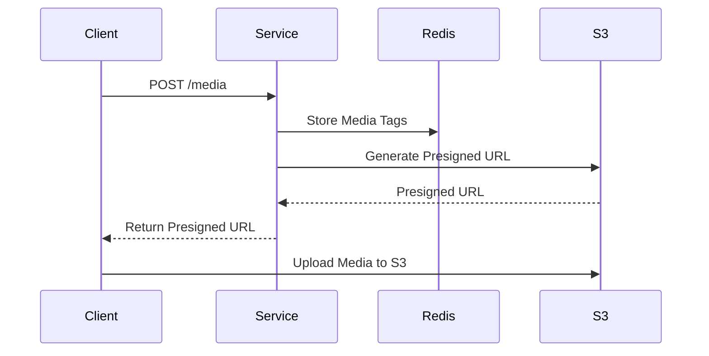
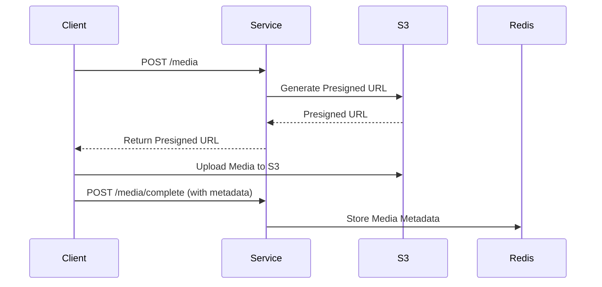
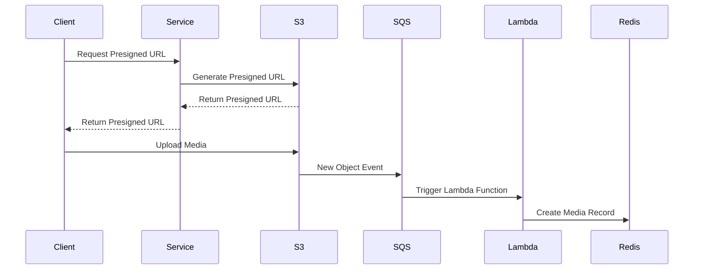

# ScorePlay Media Management Service

## Overview

This project implements a media management service for ScorePlay, aimed at helping sports organizations efficiently store, index, and retrieve media files (photos). The service is designed to allow tagging media with various labels (such as player names, locations, or competitions), simplifying the process of finding and managing specific content.

Both could be configured via environment variables. Look for an example at [`example_test.go`](example_test.go)

Communications between the server and the client goes via [RESTAPI](openapi.yaml)

## Features

1. **Create a Tag**: The service allows creating tags, which can be associated with media files.
2. **List All Tags**: The service supports retrieving a list of all created tags.
3. **Create Media**: Users can upload media files (photos) and associate them with tags. Media is stored in AWS S3, and the service generates presigned URLs to handle the file upload process securely.
4. **Search Media by Tag**: Media can be searched using associated tags, and relevant media entries are retrieved.

## Assumptions
- Creating media also involves upserting tags

## API Endpoints

### Create a Tag

**Endpoint**: `POST /tags`
**Request Body**:

```json
{
  "name": "Player Name"
}
```

**Response**:
`201 Created`
No response body.

### List All Tags

**Endpoint**: `GET /tags`
**Response**:

```json
[
  "Player Name",
  "Location Name",
  "Competition Name"
]
```

### Create Media

**Endpoint**: `POST /media`
**Request Body**: JSON with fields:

- `name` (string): Name of the media item.
- `tags` (array of strings): List of tags associated with the media.

Example:

```json
{
  "name": "Super nice picture",
  "tags": ["Player Name", "Location Name"]
}
```

**Response**:
`201 Created`

**Response Body**:

```json
{
  "url": "https://s3.amazonaws.com/bucket/file.jpg",
  "method": "PUT",
  "signedHeader": {"Host": ["localhost:1234"]}
}
```

### Search Media by Tag

**Endpoint**: `GET /media?tag={tag}`
**Response**:

```json
[
  {
    "name": "Super nice picture",
    "tags": ["Player Name", "Location Name"],
    "fileUrl": "https://s3.amazonaws.com/bucket/file.jpg"
  }
]
```

## System Architecture

The application follows a service-oriented architecture where requests flow through various layers, from API handlers to the underlying Redis and AWS S3 storage systems.

### Sequence Diagram for Media Upload



## Data Storage in Redis

Tags and media metadata are stored in Redis as follows:

- **Tags**: Tags are stored as members of a Redis set. This ensures that all tags are unique and allows for efficient retrieval.
  - Key: `tags`
  - Type: Set
  - Members: Tag names (e.g., "Player Name", "Location Name")

- **Media Metadata**: Media metadata, including its name, associated tags, and URL, are stored in a Redis hash.
  - Key Pattern: `media:{media_id}`
  - Type: Hash
  - Fields:
    - `name`: The name of the media
    - `tags`: A comma-separated list of associated tags

## Alternative Approaches

### 1. Additional Endpoint for Media Confirmation

One alternative approach is to add an additional endpoint that the client must call after uploading the media file to S3. Only after this confirmation would the media record be fully created in the system.

**Sequence Diagram**:



### 2. Using SQS for S3 Event Notifications

Another approach is to add AWS SQS to the system. S3 can be configured to generate an event whenever a new object is added. The presigned URL and headers can contain additional metadata, such as tags and name. In this case, there would be no need to handle media creation in `POST /media`. Instead, the completion of the upload would trigger an event to SQS, and an AWS Lambda function could automatically create the media record in the database.

**Sequence Diagram**:



## Technologies and Design Choices

1. **Golang**: The backend is implemented in Go for its simplicity, concurrency features, and strong performance characteristics.
2. **Redis**: Used for fast, in-memory storage and retrieval of tags and metadata associated with media files.
3. **AWS S3**: Media files are stored in S3, and presigned URLs are used for secure file uploads.
4. **Zerolog**: Employed for structured logging throughout the application to capture meaningful logs in a production environment.
5. **OpenAPI**: The API interface is defined using OpenAPI for consistency and ease of integration.

## Improvements with More Time

1. **Pagination**: Currently, the service fetches all tags or media at once. Pagination should be added to handle large datasets efficiently.
2. **Rate Limiting and Caching**: Implementing rate limiting to prevent abuse and caching frequently accessed media would improve performance and reduce load on Redis and S3.
3. **Authentication and Authorization**: Securing API endpoints by adding authentication (e.g., JWT tokens) and authorization mechanisms for role-based access control.
4. **Testing**: While the current logic is tested, further integration and end-to-end tests, especially around edge cases, would increase confidence in the system's stability.

## How to run

### Server

```console
$ make docker
```

### Basic integration tests

```console
$ make integration
```
